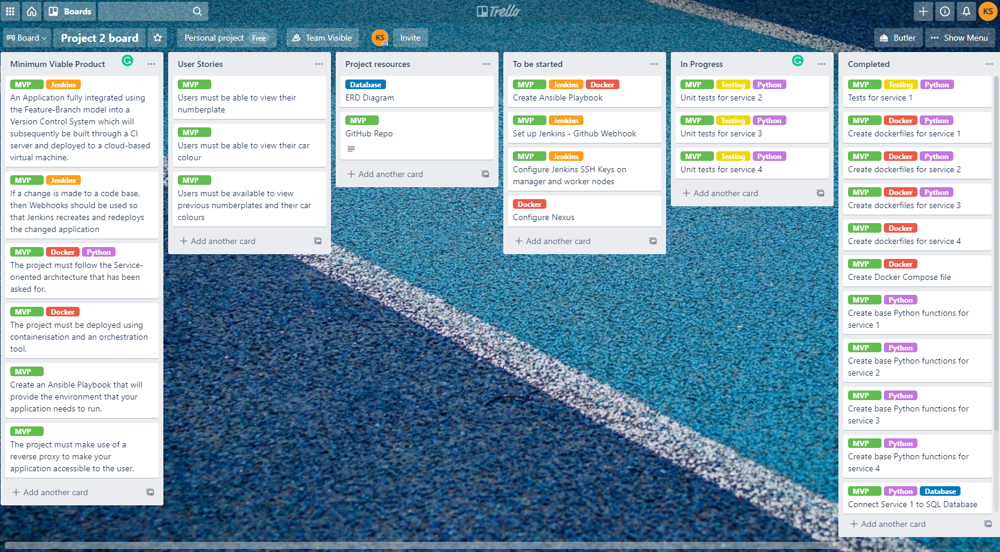
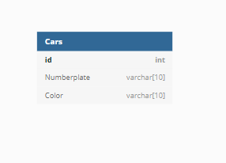
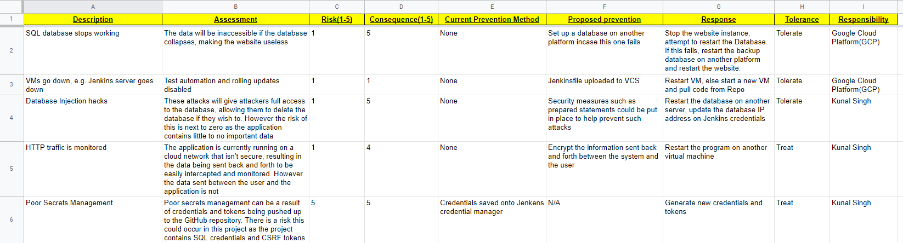
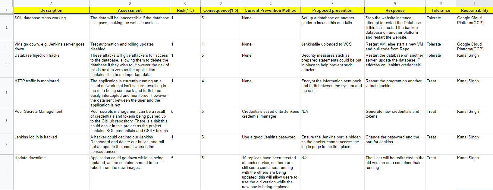
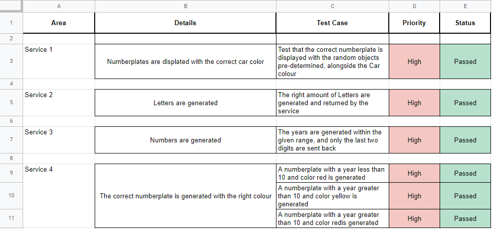
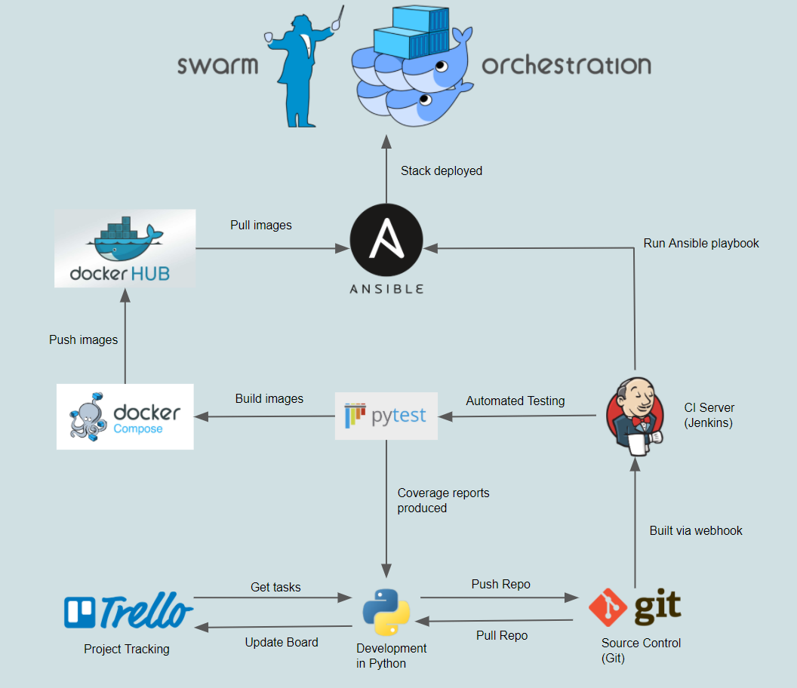
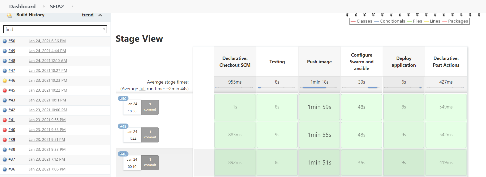
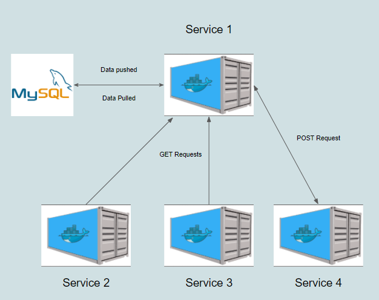
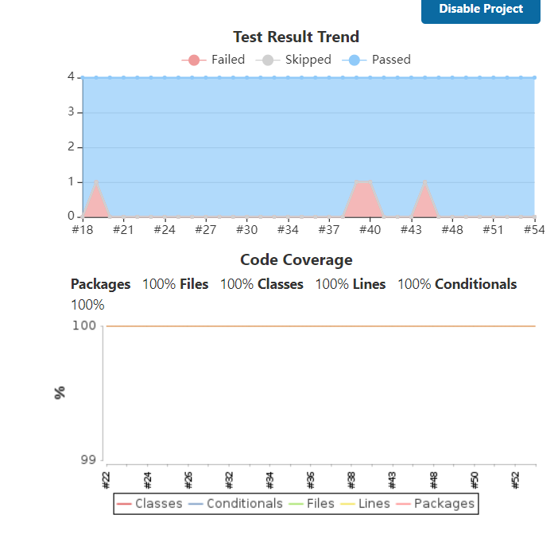
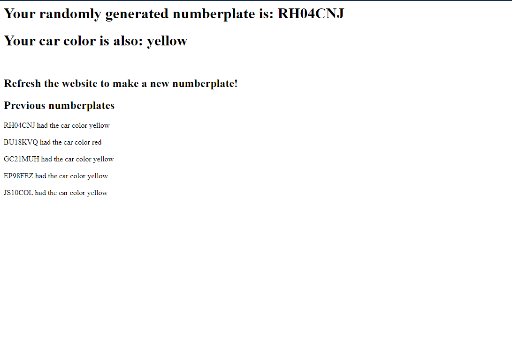

# DevOps Core Practical Project
As part of my training to become a DevOps engineer at QA, I was asked to create an application that generates "Objects" upon a set of predefined rules. This application must be based on a service-orientated architecture, composed of four services.

These four services all rely on each other to function. Service one handles the front-end of the program while communicating with all the other services to produce an output to the user, while storing them in an SQL database. Service 2 and 3 produce the randomly generated objects that are then used to create the final output for the user in service 4.

The complexity of the program itself is rather simple, since an emphasis was placed instead on ensuring the correct technologies were implemented and functioning properly. These technologies include but are not limited to: 
 - Containerisation of modules via **Docker**, orchestrated by **Docker Swarm**
 - Server provision and task automation via **Ansible**
 - Load balancing via **NGINX**, allowing for the use of an reverse proxy
 - Automated testing and deployment via **Jenkins**, executed by GitHub **Webhooks**

## Numberplate generator
To explain in brief terms, this project will create a web application that generates a numberplate on each refresh, while also showing the colour of the car that is determined by a set of predefined rules.

# Contents

To be added at the end

# Software Design

This section will explore the varies methods used to plan the development of this project.

## Planning

Before any development commenced, a Kanban board was created on Trello. The board holds information on what's currently in development, who is working on it and where something is in the process. It also stores project resources, User stories and Minimum viable product (MVP) requirements.

## Database

As this program only makes use of one table, an entity-relation diagram cannot be created, and so an entity diagram below is shown instead.

The table has three attributes:
- id : Uniquely represents each entity and is the primary key of the table
- Numberplate : Stores the numberplate of the car
- Color : Stores the color of the car 

## Risk Assessment

A risk assessment was also carried out as a tool for identifying and preventing potential project risks. However, unanticipated risks are expected as in any project, and so risks as added while the program is in development. The two images below show the risks before and after development:

Before development:

After development:

## Test plans

Test plans were also designed to ensure all aspects of the program were tested. The table below explains how each service is expected to be tested.

# Continuous Deployment and Integration

A CI-CD pipeline was implemented in this project to allow for the automation of development in to live builds. The diagram below explains the pipeline very well:

To implement this pipeline in to the project, a Jenkins pipeline was set up:

As shown above, there are 5 main stages in the pipeline:
1) Testing: All tests are carried out and reports are produced for Jenkins to view
2) Push image: Docker credentials are uploaded from Jenkins, which are then used to push the images of the services once they are built
3) Configure Swarm and Ansible: The Ansible playbook is run, which starts NGINX, initiailizes Docker Swarm and adds the managers and worker nodes.
4) Deploy application: The stack is deployed with the Docker-Compose file, and the environmental variables are also set
5) Post Actions: The test reports are posted to view the tests that have passed and test coverage.

# Architectures

### Docker-Compose
The first main framework used is Docker-Compose. Docker compose is a tool used to define and run multiple containers at the same time, within the same network by running one command: `docker-compose up`. These containers are all generated by images created by individual dockerfiles which need to be placed in the directory of each service.

### Docker Swarm
As this project is containerised, it benefits from the ability to be moved and scaled across different nodes. This is because containers ensure that the application is run in the same where anywhere. A downside to this scalability is the maintainence costs it brings, however these costs can be avoided by bringing an orchestrator, such as Docker Swarm.

Docker Swarm automates the maintenance this project by replacing failed containers automatically, and managing rollout of updates. Docker Swarm uses all the virtual machines in this project and forms one system that users can access. This can be shown below in the diagram:

## NginX

As shown above, NginX was implemented as not only as a load balancer, but also as a reverse proxy. Users are able to visit one URL, and they are shown the application. But behind the scenes, NginX sends the user's request to the container with the least load, providing an addtional layer of security and anonymity.

## Ansible
Instead of having to go into each individual Virtual machine and setting up the build environment, such as installing docker or initializing the swarm and adding each node, Ansible playbooks could be used instead, which help incorporate infrastructure automation and reduce human error.

Ansible works by excuting the commands in the playbook over SSH, so all that needs to be configured are SSH keys on all nodes.

# Service configuration

As mentioned before, this project relies on 4 services that work with each other to produce the output needed. This system is outlined in the diagram below. Service 1, which is the front-end aspect of the application, creates the html page for the users to see, while displaying the numberplate and car colour generated for the User. It also shows the previous 5 numberplates generated, which are fetched from the SQL Database.

For service 1 to display a new numberplate, it needs service 2 to randomly generate 5 letters, and service 3 to generate a random year. These two randomly generated objects are then sent to service 4 by service 1, which then generates the numberplate, as well as the car color, and sends it back to service 1. This diagram below outlines this procedure:

# Test Results

PyTest was used to test this project, with the help of the Unittest Mocking as there are many random modules used to generate objects. Mocking helps test random modules as it forces the output of the random statement to be set before the test is run, allowing for the testing of the rest of the code. These tests were then automated by Jenkins, running everytime the program is deployed. The results can then be viewed on the build page, as shown below:

The report first graphs how many tests failed, were skipped or passed, followed by code coverage. Thanks to Mocking, a code coverage of 100% was achieved, which meant that each line of code in the services was run atleast once during testing. This ensures the validity of the tests. 

## Refactoring

Initially, the Jenkins script file for testing was written as so:

    #Testing service 1
    cd service_1
    python3 -m venv venv
    source venv/bin/activate
    pip3 install -r requirements.txt
    pip3 install pytest pytest-cov flask_testing
    python3 -m pytest --cov=application --cov-report xml --cov-report term-missin --junitxml junit.xml
    deactivate
    cd ..
Where this block of code was repeated 4 times, for each service. To make the code more efficient, a for loop was used, the requirements were only installed once, and the tests were all run in one virtual environment.

    python3 -m venv venv
    source venv/bin/activate
    pip3 install pytest pytest-cov flask_testing requests_mock flask_sqlalchemy
    pip3 install -r service_1/requirements.txt

    for i in 1 2 3 4
    do
        cd service_$i
        python3 -m pytest --cov=application --cov-report xml --cov-report term-missing --junitxml junit.xml
        cd ..
    done
    deactivate

# Front-End Design

An example of what the user would see when they first enter the website is shwon below. A new numberplate is generated followed by a car colour, and the previous 5 numberplates are also shown.

# Future improvements

- Improved CSS Design
- More Car colours
- Users able to log in and post pictures of their cars, with their numberplates

# Author

Kunal Singh

## Contributors

Harry Volker